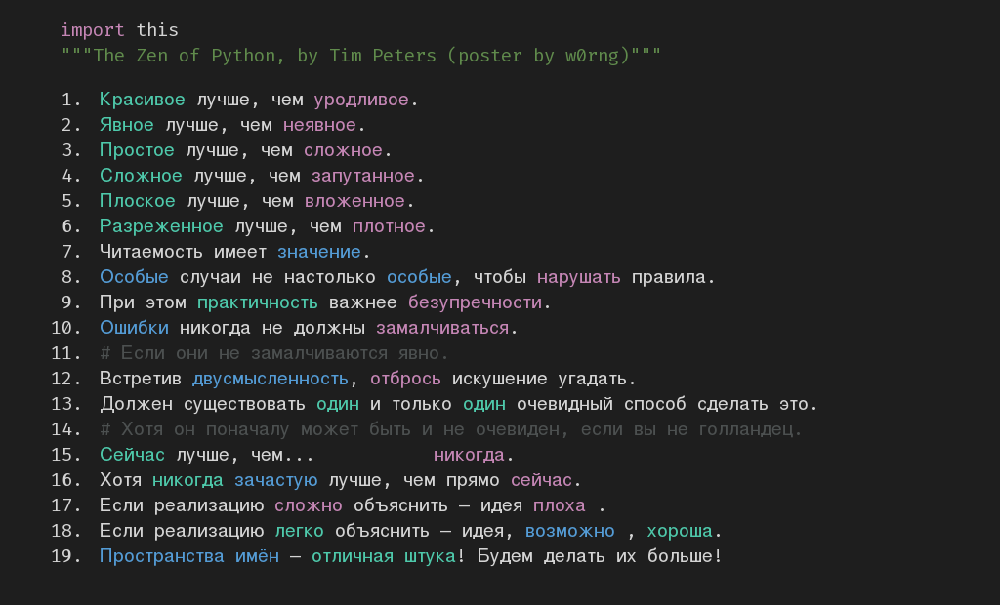
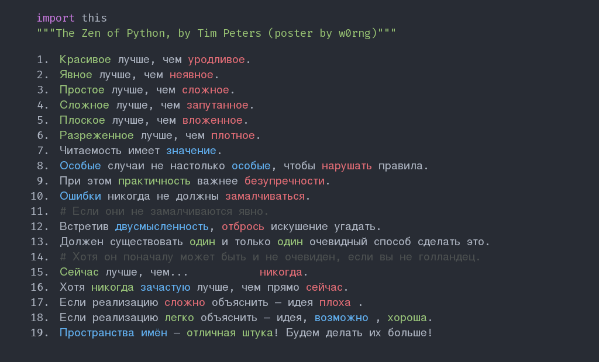
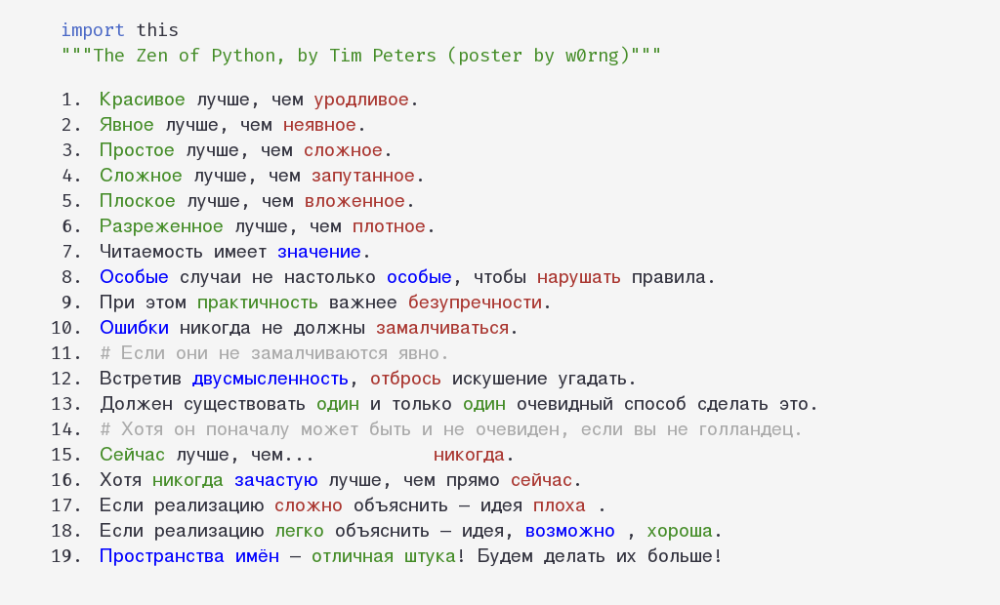

# Постеры  
## F.A.Q.  
**Q**: Что это?  
**A**: Это постеры с zen python.  

**Q**: Зачем это?
**A**:   Во-первых, это красиво, можно на стенку повесить. Во-вторых, это полезные рекомендации для написания кода и стиля жизни.  

**Q**: ...  
**A**: Вдохновлено [zen-of-python](https://github.com/ewjoachim/zen-of-python).  

  
  
  